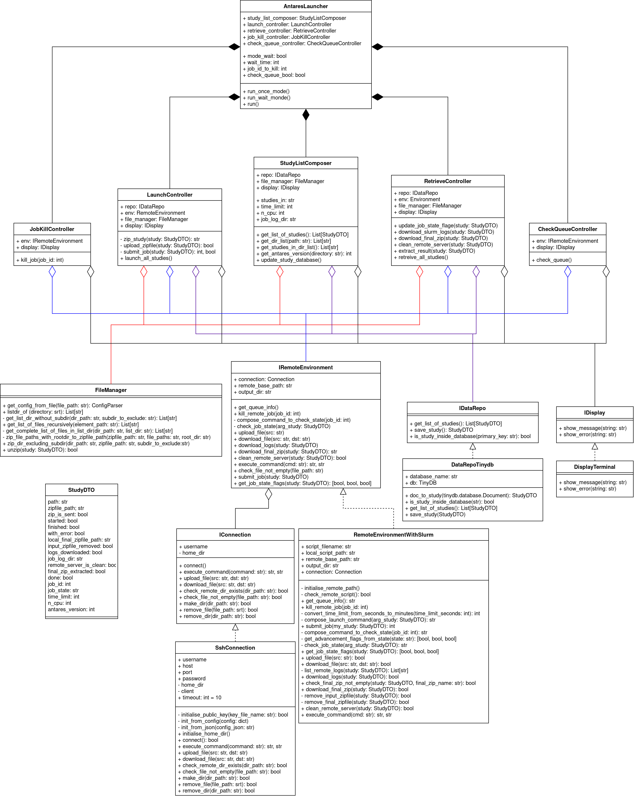

*****************
Development Guide
*****************

This part of the documentation is for developers.

The aim is to have a design doc ready to be shared with any other dev. It should greatly help people getting in the project.

The goal is to give you more information about the module : what exactly it does, why and eventually to have in mind the
global architecture of the code

Advanced Options:

+---------------------------------------+----------------------------------------------------+-------------------------------------+
| `--log-dir=JOB_LOG_DIR`               | directory where the logs of the jobs will be found | register inside the directory       |
|                                       |                                                    | `JOB-LOGS`                          |
+---------------------------------------+----------------------------------------------------+-------------------------------------+
| `-n N_CPU`, `--n-cores=N_CPU`         | number of cores to be used for a single job,       |                                     |
|                                       | max 12                                             |                                     |
+---------------------------------------+----------------------------------------------------+-------------------------------------+
| `--ssh-settings-file=JSON_SSH_CONFIG` | path to the configuration file for the ssh         | `JSON_SSH_CONFIG=.\ssh_config.json` |
|                                       | connection                                         |                                     |
+---------------------------------------+----------------------------------------------------+-------------------------------------+
| `-k`                                  | Kill a job on remote server arg: JOBID             |                                     |
+---------------------------------------+----------------------------------------------------+-------------------------------------+

*****************
Binary generation
*****************

.. mdinclude:: ./binary_generation.md

**************
Doc generation
**************

.. mdinclude:: ../README.md

*************
Class diagram
*************

Here below, one can find the Class diagram for a global view.

****************
Sequence diagram
****************

Here is the UML sequence diagram. From that global representation, make a diagram with more details for developpers ?

.. image:: ./schema/final_full_antares_flow_chart.png
   :align: center
