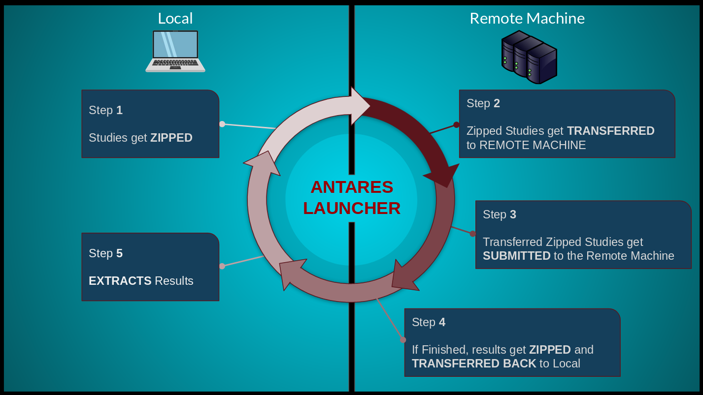

.. Antares_Launcher documentation master file, created by
   sphinx-quickstart on Mon Jul 29 13:12:25 2019.
   You can adapt this file completely to your liking, but it should at least
   contain the root `toctree` directive.

Welcome to Antares Launcher's documentation!
============================================

Antares Launcher (AL) allows users to seamlessly send and submit a list of Antares simulations on a remote Linux machine.

Antares Launcher can be viewed as a plugin for Antares, it creates a bridge between your local computer and a remote server/machine.
It is a simple tool that allows you to export computations to a distant slurm server.

A couple of computation options are described in "User Guide" section.

This diagram describes the behavior of the module between your local computer and the distant machine.

.. A more detailed explanation can be found below:

.. .. figure:: ./schema/al_main_poster.png

.. toctree::
   :maxdepth: 3
   :caption: Guides:

   user_guide.rst
   development_guide.rst

.. toctree::
   :maxdepth: 3
   :caption: Code documentation

   api/modules.rst

.. toctree::
   :maxdepth: 0
   :caption: Miscellaneous

   roadmap.rst
   changelog.rst

Indices and tables
==================

* :ref:`genindex`
* :ref:`modindex`
* :ref:`search`
