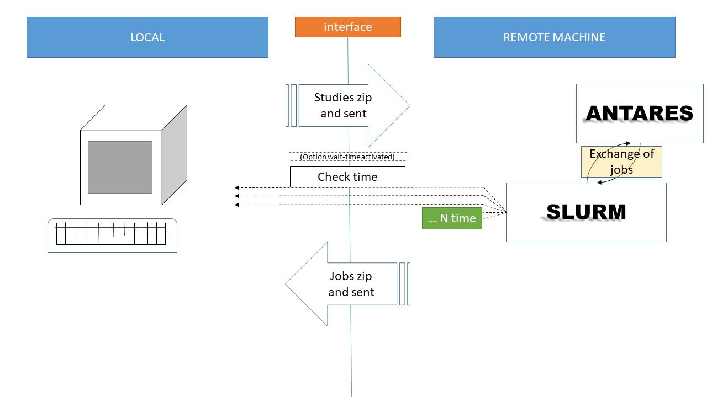
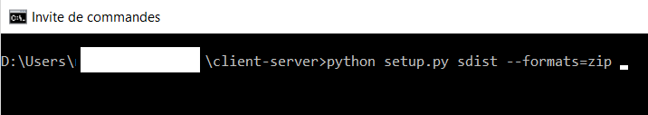
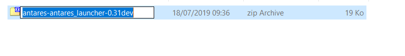
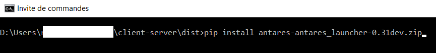
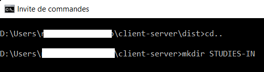
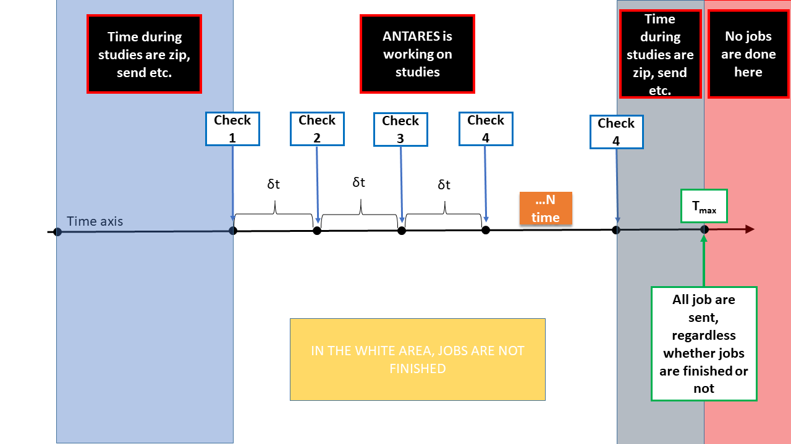

Introduction
============

This documentation presents the Antares Launcher module.

It starts with a short overview of the module. Then, the installation process and
the UserGuide are presented, followed by Quick Start examples, Options, and additional information.

The second part of this documentation is dedicated to developers.
It consists of a simple code-documentation, class diagram, sequence diagram and information about the generation of the of documentation.

--------------

Antares Launcher can be viewed as a plugin for Antares, it creates a bridge between your local computer and a remote server/machine.
It is a simple tool that allows you to export computations on a slurm server.

A couple of computation options are described in "User Guide" section.

This schema describe the behavior of the module between your local computer and the distant machine.

|image0|

.. code:: python

