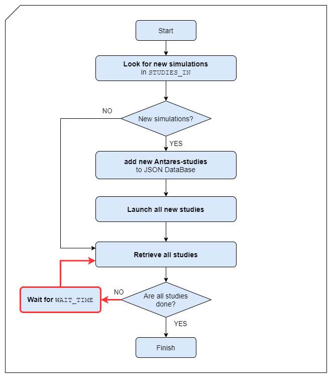

User Guide
==========

The basic usage of Antares_Launcher consists in preparing a working directory, for instance
``BASE``. \ \
The structure of the ``BASE`` directory should be organized as following.
A ``STUDIES-IN`` directory which contains all the *Antares* studies and the binary file
``Antares_Launcher(.exe)`` which is placed at the root of the ``BASE`` directory.

The directory where ``Antares_Launcher`` is executed looks like this

::

    🗀 BASE
    |
    ├──🗀 STUDIES-IN
    |  |
    |  ├── 🗀 study1
    |  ├── 🗀 study2
    |  └── 🗀 study3
    └─── Antares_Launcher(.exe)

Once you have put the studies (for example ``study1`` ``study2`` etc... ) inside the
right directory (``STUDIES_IN`` in the present example), you just have to run the ``Antares_Launcher`` binary file.
You can do it using a terminal window (for Windows: shift+mouse-right-click then open command window here),
or by double click on the executable (.exe) file.
Each antares study will correspond to one separate job in slurm.

The module will (see the diagram below for extra details):

- **look** for the presence of "Antares Study" directories:
   - it will search inside ``STUDIES-IN`` (or another user-specified directory via the -i PATH_TO_THE_DIRECTORY option).

- **Launch all new studies** for each new Antares Study:
    - **Compress** each study in zip a file

    - **Send** the study to the slurm server

    - **Submit** the job to slurm queue

- **Retrieve the studies.** For each unfinished study:
    - **Download** the logfiles of the jobs inside LOGS/JOB_LOGS/JOB_NAME_JOBID directory

    - **Check** if the job is "done": the console will display the status of the studies (COMPLETED, RUNNING, PENDING, TIMEOUT)

    - **Download** finished job in a zip file

    - **Extract** finished job inside a folder named FINISHED

**If all jobs are not finished**, the program will say :  "still something to do but I'll exit SEE YOU!"

**If all jobs are finished**, the program return :"Nothing to do, GOODBYE". The structure of the final folder BASE will look like that:
::

    🗀 BASE
    |
    ├──🗀 STUDIES-IN
    |   |
    |   ├──🗀 study1
    |   ├── study1-username.zip
    |   ├──🗀 study2
    |   ├── study2-username.zip
    |   ├──🗀 study3
    |   └── study3-username.zip
    ├── 🗀 LOGS
    |   |
    |   ├── 🗀 JOB-LOGS
    |   |   ├── 🗀 study1_id
    |   |   ├── 🗀 study2_id
    |   |   └── 🗀 study3_id
    |   └── antares-antares_launcher.log
    ├── 🗀 FINISHED
    |   |
    |   ├── finished-study1_id.zip
    |   ├──🗀 study1
    |   ├── finished-study2_id.zip
    |   ├──🗀 study2
    |   ├── finished-study3_id.zip
    |   └──🗀 study3
    ├── username_antares_launcher_db.json
    └── remote_antares_launcher.py

**DO NOT DELETE the json FILE**, (``username_antares_launcher_db.json`` in the example)
it contains the all the memory of the application as it is run in your directory, for instance
where and how to retrieve the simulations that are run on the distant machine. Removing this file will put in danger the retrieval of
the results of your simulations.

Inside the **LOGS** directory you can find all notifications which are reported by Antares_Launcher.
Inside **LOGS/JOB_LOGS/name_of_the_study_jobID/** job-specific logs can be found: the output and the error of the Antares
simulations, and the log of the job submission.

You can download the finished jobs (status: COMPLETED) another time or check the status of the studies by running again the binary file: Antares_Launcher(.exe)

Basic execution
---------------

By simply launching Antares_Launcher with no options or by double click on the executable file:

::

   Antares_Launcher(.exe)

The execution flows look like this:

Options
-------
You can run Antares_Launcher using several options described below.
You need to execute the following commands inside a console to use those options specifically on Windows.
To open the Windows command prompt, open the ``BASE`` directory and press **shift-key** +
**right-click** (not on a file, but on the background of the directory window). Then you will see 'Open command window here' ('Ouvrir une fenêtre de commandes ici') option.

Here are the basic options you can use :

1. Wait mode
^^^^^^^^^^^^

::

    Antares_Launcher(.exe) -w

The wait mode activates regular checks which automatically download logs and jobs, and gives the status of all studies.
**Antares_Launcher** periodically checks all the unfinished studies (by default every 15 minutes).
This is equivalent to running ``Antares_Launcher(.exe)`` every 900 seconds.

The execution flow will look like this. Notice the red arrows showing that whether a job is finished or not, Antares
Launcher will keep checking the statuses of all submitted jobs until they are all finished.

A simple countdown is displayed to show the remaining time left before the next check, as shown in the next image.

When the countdown finishes, Antares Launcher loops back to check and retrieves all unfinished studies if available. An example is
shown below:

2. Wait time
^^^^^^^^^^^^

::

    Antares_Launcher(.exe) –w –wait-time=XXXXX

This option can be used only if you trigger the wait mode. This option allows to change the frequency of check in the wait mode (by default : 900 seconds).

3. Time limit
^^^^^^^^^^^^^

::

    Antares_Launcher(.exe) --time-limit

This option sets the total time limit given to jobs on the slurm server.
If jobs are submitted with a short *time-limit*, the jobs can be executed earlier.
If a job requires to run for a time longer than *time-limit*,
it will be killed and it will not be possible to retrieve any result.

The default value is set to 48 hours.

4. Checking the queue
^^^^^^^^^^^^^^^^^^^^^

::

    Antares_Launcher(.exe) –q

It only displays the queue and the status of all Antares jobs on the slurm server.
This command is also useful to get the JobID (unique identification number) of a specific job.

5. Xpansion mode
^^^^^^^^^^^^^^^^

::

    Antares_Launcher(.exe) –x

It computes studies in xpansion mode. Only, xpansion studies which contains the `candidate.ini` file are calculated.
It launches the following R code:

::

    setSimulationPath(SIMULATION_PATH, simulation = 0)
    benders(path_solver, display = TRUE, report = TRUE)

6. Post-processing
^^^^^^^^^^^^^^^^^^

::

    Antares_Launcher(.exe) –p

This option will trigger a post-precessing phase once the execution of Antares or AntaresXpansion is ended.
By activating this option at the end of the simulation an *R script* is executed.
This option can be used only if an *R script* named `post-processing.R` is present in the directory of the Antares study.
The correctness of the `post-processing.R` script is left to the responsibility of the user.
Several Antares R packages can installed on the slum server, including the latest version of the *AdequacyPatch*.

Things to note:

- it is essential that the study directory contains an **Rscript** named `post-processing.R`
- the **Rscript** named `post-processing.R` will be executed inside the directory of the study,
    to indicate the path to the study `.` should be used (e.g. `setSimulationPath("./", 1)`)

The directory of the study should look like this

::

    🗀 STUDIES-IN
    |
    ├──🗀 MY-STUDY
    |  |
    |  ├── 🗀 input
    |  ├── 🗀 layers
    |  ├── 🗀 logs
    |  ├── 🗀 settings
    |  ├── 🗀 user
    |  ├── Desktop.ini
    |  ├── post-processing.R
    |  └── study.antares
    └

An example of post-processing script would look like this (built for the Adequacy-Patch)

post-processing.R for the adequacy patch of a specific study: notice the setSimulationPath
::

    library(antaresRead)
    library(AdequacyPatch)
    library(antaresEditObject)
    library(data.table)
    library(fs)
    library(plyr)
    library(doParallel)
    library(progressr)
    library(progress)
    library(pipeR)

    opts <- setSimulationPath("./",
                                1) # the first output (inside the output directory)

    areas <- c("fr", "at", "be", "de", "nl", "es", "ukgb", "ch", "ie", "itn", "zz_flowbased")

    virtual_areas = getAreas(select = "_",
                            regexpSelect = TRUE,
                            exclude = c("zz_flowbased"),
                            regexpExclude = FALSE)

7. Kill job
^^^^^^^^^^^

::

    Antares_Launcher(.exe) –k JOB_ID_TO_KILL

It kills the job (simulation) corresponding to the specified JOB_ID.
Antares_Launcher will not be able to kill a job that is not present in the database of the user.

8. Option list
^^^^^^^^^^^^^^

You can get the list of options by using this command :

::

    Antares_Launcher(.exe) –h

+------------------------------------------+----------------------------------------------------+----------------------------------+
| command option                           | explanation                                        | default value                    |
+==========================================+====================================================+==================================+
| --version                                | show program version number and exit               |                                  |
+------------------------------------------+----------------------------------------------------+----------------------------------+
| -i STUDIES_IN or                         | directory containing the studies to be executed    | the studies we are looking for   |
| --studies-in-dir=STUDIES_IN              |                                                    | must be in ``STUDIES-IN``        |
+------------------------------------------+----------------------------------------------------+----------------------------------+
| -w or --wait-mode                        | activate the wait mode: the antares_launcher       | deactivated                      |
|                                          | waits all the jobs to finish                       |                                  |
+------------------------------------------+----------------------------------------------------+----------------------------------+
| -o OUTPUT_DIR or --output-dir=OUTPUT_DIR | directory where the finished studies will be       | done jobs are put inside         |
|                                          | downloaded and extracted                           | ``FINISHED`` directory           |
+------------------------------------------+----------------------------------------------------+----------------------------------+
| -t TIME_LIMIT or --time-limit=TIME_LIMIT | time limit in seconds of a single job              | 5h = 18000 seconds               |
+------------------------------------------+----------------------------------------------------+----------------------------------+
| --wait-time=WAIT_TIME                    | number of seconds between each verification        | 60 seconds                       |
|                                          | of the end of the simulations                      |                                  |
+------------------------------------------+----------------------------------------------------+----------------------------------+
| -q                                       | displays the queue of Antares jobs                 |                                  |
+------------------------------------------+----------------------------------------------------+----------------------------------+
| -x                                       | run all new (compatible) studies in xpansion mode  |                                  |
+------------------------------------------+----------------------------------------------------+----------------------------------+
| -p                                       | trigger *R* post-processing                        |                                  |
+------------------------------------------+----------------------------------------------------+----------------------------------+
| -k JOB_ID_TO_KILL  or                    | kill a job by specifying its JOB_ID                |                                  |
| --kill-job  JOB_ID_TO_KILL               | It overrides the ``-q`` or the standard execution  |                                  |
+------------------------------------------+----------------------------------------------------+----------------------------------+

Errors and exception
--------------------

There is a configuration issue if the console displays this message :

::

    CRITICAL - No path to the configuration file for the ssh connection was given

Go back to ask help to the team who installs the Antares_launcher or try this :

::

    Antares_Launcher(.exe) --ssh-settings-file=PATH\TO\THE\ssh_config.json

Detailed workflow
=================

To explain it in more details, from this point on forward, the flow charts will contain more information.

Detailed version of the flow chart:

**STEP 1**

Lets say you added a study named sta-2 and executed Antares Launcher... The output should look like this.

**STEP 2**

Now that the study has been submitted on the remote machine, we have to execute the binary a second time for Antares
Launcher to check if the job is finished and to extract it back locally.

